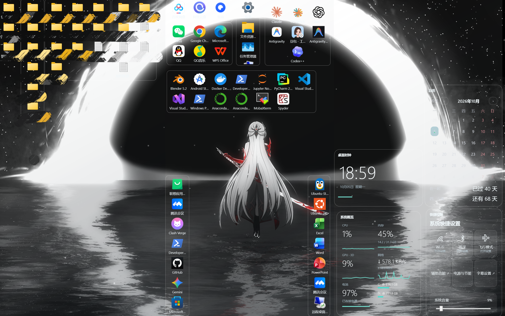

# TrifoldDesk · 三折桌面

Windows 桌面整理工具：用左、中、右三个可独立折叠的页面，放置应用、文件夹和按需添加的小部件。



## 功能

- **三页布局**：独立折叠，组件拖动后归属最近的页面，并限制在页面边界内。
- **桌面文件夹**：拖入文件、目录和快捷方式；固定网格自由排序、保留空位、跨文件夹移动，支持四角调整大小和竖向滚动。
- **独立图标**：将入口拖出文件夹，放在当前页面空白处；也可拖回文件夹。停留在文件夹边缘可逐步扩展显示区域。
- **应用选择**：从已安装应用中搜索、选择并添加入口，保留启动参数，区分不同安装环境。
- **组合监控**：CPU、内存、GPU 3D、网速、电池和各磁盘容量，可组合显示或单独添加。
- **日历与日期计算**：月历、农历提示、月份切换，以及自定义倒计时和已过去天数。
- **按需添加**：时钟、日历、监控和系统控制等内置组件可自行选择；支持拖动、缩放、锁定和移除。
- **桌面运行**：默认保持在普通窗口下方，提供托盘入口和开机登录自启动设置。

操作集中在右键菜单，桌面仅保留内容与必要的控件。

## 下载运行

[下载 Windows x64 中文安装包](https://github.com/partjava/TrifoldDesk/releases/latest)。下载 Setup EXE 后双击，按向导选择安装位置。安装版内置运行环境，无需单独安装 .NET；支持开始菜单、可选桌面快捷方式、开机自启动与卸载。旧版 ZIP 免安装包仍需 .NET 8 Windows Desktop Runtime。

## 从源码构建

当前版本为 **0.10.12**。适用于 Windows 10/11 x64。

安装 .NET 8 SDK，或具备 .NET 8 目标框架支持的更新 SDK，然后在项目根目录打开 PowerShell：

```powershell
git clone https://github.com/partjava/TrifoldDesk.git
cd TrifoldDesk
.\Build.ps1 -Test -Version '0.10.12'
.\启动三折桌面.bat
```

构建结果位于 `dist/v0.10.12/`。运行需要 **.NET 8 Windows Desktop Runtime x64**，请保留整个发布目录，不能只复制 EXE。

## 使用

| 操作 | 方法 |
| --- | --- |
| 添加组件、管理入口、个性化 | 桌面空白处右键 |
| 折叠或展开某页 | 空白处右键，选择左、中、右页 |
| 添加文件或应用 | 拖入文件夹，或在文件夹空白处右键添加 |
| 移动图标 | 拖到目标网格；空位会保留 |
| 调整组件大小 | 拖动组件四角 |
| 添加倒计时或纪念日 | 日历右键 → 添加日期 |
| 修改日期事件 | 点击事件，或右键编辑、删除 |
| 设置自启动 | 托盘或桌面右键进入设置 |
| 退出 | 托盘菜单 → 退出；Alt+F4 会收起桌面 |

移除入口不会删除原文件；移除组件会保留应用和资料入口数据。

## 数据保存

配置保存在 `%APPDATA%\TrifoldDesk`，包含布局、组件、文件夹和快捷入口。配置采用 JSON，并提供备份与损坏恢复。仓库不包含个人配置、应用列表和运行日志。

## 当前限制与待完善项

- 插件库目前是**内置组件**，尚未提供第三方插件安装或运行接口。
- 温度、风扇转速和显存监控尚未接入；GPU 当前显示 Windows 的 3D 引擎使用率。
- 磁盘条显示逻辑卷容量；开机自启动指用户登录后的启动。
- 桌面底层模式仍需验证 Win+D、资源管理器重启及真实注销后自启动的行为。
- 文件拖动的速度区分、边缘扩展与跨文件夹交互仍需更多实际鼠标操作验证。
- 天气、通知提醒、完整便签和真正的三维折叠效果尚未完成。

## 项目结构

```text
src/TrifoldDesk.App/      WPF 界面、Windows 集成与组件
src/TrifoldDesk.Core/     配置、布局与入口逻辑
tests/TrifoldDesk.Tests/  核心检查
Build.ps1                构建和窗口自测
AutoStart.vbs            自启动入口
home.png                 桌面效果图
```

`Build.ps1 -Test` 会执行核心检查与独立数据目录下的窗口自测。更多说明见 [开发说明](docs/开发说明.md)。

## 构建安装包

安装 Inno Setup 6.7 或更新版本后，运行 BuildInstaller.ps1 -CompilerPath '你的 ISCC.exe 路径'。脚本发布 Windows x64 自包含程序，并编译 installer/TrifoldDesk.iss；需要访问官方 NuGet 包源。输出在 dist/installers。
